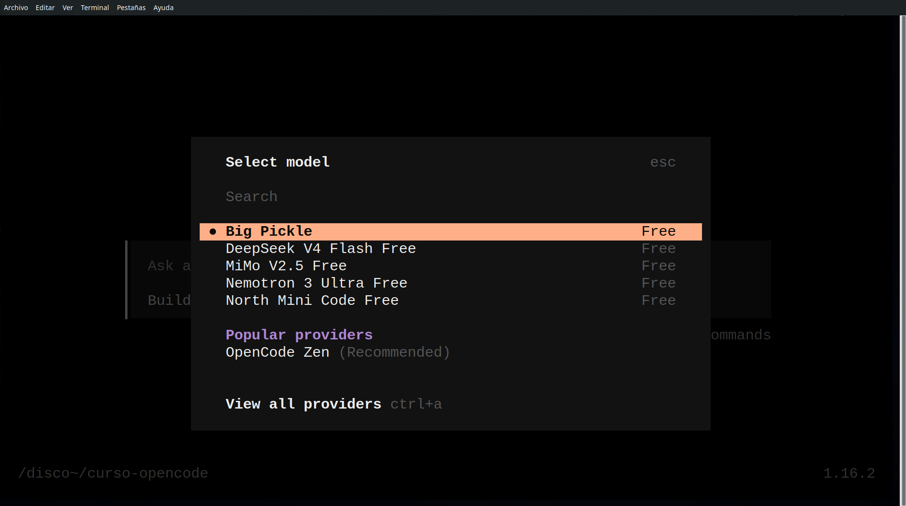
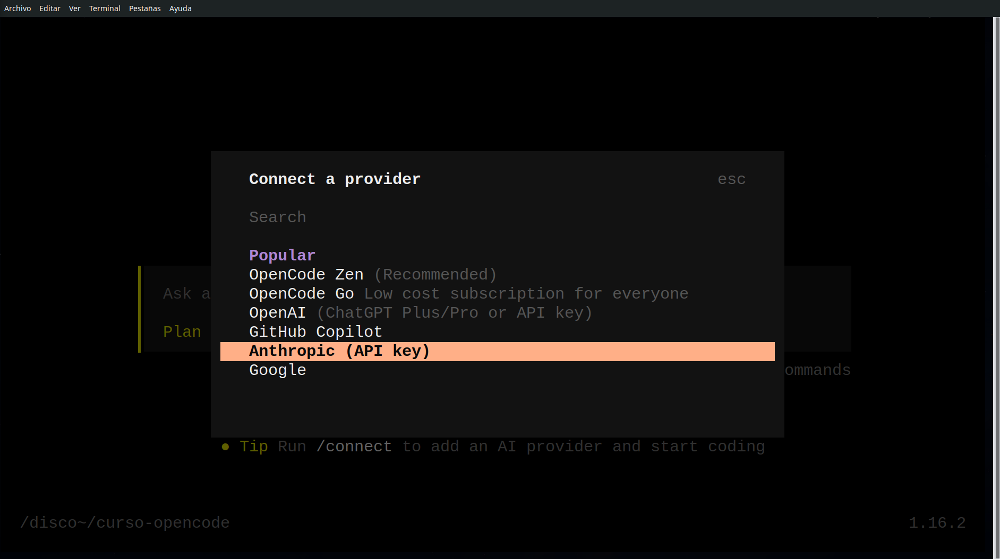

## Objetivo

Entender los modelos de IA disponibles en OpenCode, cómo alternar
entre ellos y cómo conectar nuevos proveedores.

Duración estimada: **20 minutos**

---

## Modelos: ya tenemos opciones

Cuando instalas OpenCode, ya vienen configurados algunos modelos
gratuitos (Zen). No necesitas registrar cuentas ni introducir
claves API para empezar a trabajar:

- **Zen** — modelos cloud gratuitos, vienen configurados por defecto
- **Locales** — modelos que corren en tu ordenador sin conexión (Ollama, LM Studio)

Estos modelos son suficientes para la mayoría de tareas del curso.
Si necesitas más calidad o velocidad, puedes conectar proveedores
de pago (OpenAI, Anthropic, Google...) o usar OpenRouter como
puerta de entrada a decenas de modelos.

---

## `/models` — Ver y cambiar de modelo

Escribe `/models` en el chat para ver los modelos disponibles y
cambiar entre ellos:

```
/models
```

OpenCode te mostrará una lista con los modelos configurados.
Selecciona uno y se usará en las siguientes conversaciones.

[{fig-align="center" width=40%}](modelsOC.png){target="_blank"}

### Qué modelo elegir

| Modelo | Tipo | Mejor para |
|--------|------|------------|
| Zen (gratuito) | Cloud | Uso general, aprendizaje |
| GPT-4o-mini | Cloud | Revisiones rápidas |
| GPT-4o | Cloud | Documentos largos, complejidad |
| Claude Sonnet | Cloud | Análisis profundo, escritura |
| Llama 3 | Local | Sin coste, sin conexión |

[Ampliando: Modelos de IA](ampliando/ampliando-modelos.qmd) — tabla
detallada, comparativas y estrategias por tarea

---

## `/connect` — Conectar nuevos proveedores

Si los modelos por defecto no te alcanzan, puedes conectar
proveedores adicionales con `/connect`:

```
/connect
```

OpenCode te guiará en el proceso. Necesitarás una **clave de API**
del proveedor que elijas.

[{fig-align="center" width=40%}](connectOC.png){target="_blank"}

### Proveedores clásicos

| Proveedor | Modelos habituales | Variable de entorno |
|-----------|-------------------|---------------------|
| OpenAI | GPT-4o, GPT-4o-mini, o1 | `OPENAI_API_KEY` |
| Anthropic | Claude Sonnet, Claude Haiku | `ANTHROPIC_API_KEY` |
| Google | Gemini Pro, Gemini Flash | `GOOGLE_API_KEY` |
| Groq | Llama 3, Mixtral (gratuito) | `GROQ_API_KEY` |

### OpenRouter: puerta de entrada a múltiples modelos

[OpenRouter](https://openrouter.ai) es un proxy que da acceso
a modelos de diferentes proveedores con una sola cuenta y una
sola clave API. Es útil si quieres probar varios modelos sin
gestionar múltiples suscripciones.

[Ampliando: Conexiones y proveedores](ampliando/ampliando-conexiones.qmd)
— configuración detallada de cada proveedor y OpenRouter

---

## Manos a la obra

### Ejercicio 1 — Consultar modelos disponibles

En *Plan*, escribe:

> ¿Qué modelos de IA tienes configurados?

OpenCode te mostrará los modelos disponibles. Si no tienes
ninguno configurado, usarás los modelos Zen por defecto.

### Ejercicio 2 — Cambiar de modelo

Ejecuta `/models` y selecciona un modelo distinto al actual.
Luego prueba la misma tarea con ambos modelos:

> Resume este paso en 3 puntos clave

¿Qué diferencias notas en velocidad y estilo?

### Ejercicio 3 — Comparar modelo gratuito con uno de pago

Si tienes acceso a un modelo de pago (GPT-4o, Sonnet...),
compara la respuesta con el modelo Zen:

> Explica qué es un skill en OpenCode en 2 párrafos

¿Vale la pena el coste adicional para esta tarea?

### Ejercicio 4 — Conectar un proveedor (opcional)

Si quieres probar con otro proveedor:

1. Ejecuta `/connect` y sigue las instrucciones
2. Introduce tu clave de API
3. Cambia al nuevo modelo con `/models`
4. Prueba una tarea y compara

---

::: {.callout-warning}
## Seguridad: gestión de claves

- **Nunca versiones claves API** — usa variables de entorno
- Crea un archivo `.env` en la raíz del proyecto:

```
OPENAI_API_KEY=sk-proj-...
ANTHROPIC_API_KEY=sk-ant-...
```

- Añade `.env` a `.gitignore`
- OpenCode lee `apiKey: "${VARIABLE}"` y la resuelve del entorno
:::

---

## Resumen del paso

- ✅ Sabes que OpenCode ya tiene modelos gratuitos (Zen) configurados
- ✅ Puedes ver y cambiar de modelo con `/models`
- ✅ Puedes conectar proveedores adicionales con `/connect`
- ✅ Conoces la diferencia entre modelos gratuitos, de pago y locales
- ✅ Sabes gestionar claves API de forma segura

En el próximo paso veremos cómo usar Git para versionar documentos.

---

## Para profundizar

- [Ampliando: Modelos de IA](ampliando/ampliando-modelos.qmd)
- [Ampliando: Conexiones y proveedores](ampliando/ampliando-conexiones.qmd)
- [Ollama](https://ollama.ai) — modelos locales

*Curso OpenCode 102 · Idea original de JA Palazón · Junio 2026*
